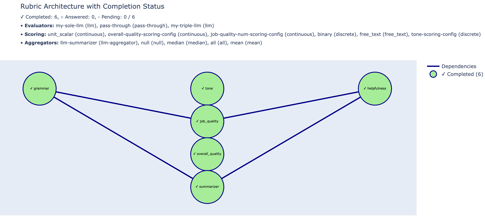

# protorubric

Open-source tools for autograding rubrics with LLMs.

## Features
- Define and evaluate rubrics for LLM-generated responses using YAML configurations.
- Support for custom scoring strategies (binary, continuous, free-text, etc.).
- Flexible aggregation methods (mean, median, mode, custom LLM-based aggregators).
- Asynchronous and synchronous evaluation workflows.
- Visualization of rubric structure and evaluation progress.
- Integration with HealthBench dataset for medical dialogue evaluation.
- Provider-agnostic via LiteLLM; built-in token-aware rate limiting and request caching.

## Installation
<details>
<summary>Click to expand</summary>
Requirements: Python 3.10 or higher.

First, install [uv](https://github.com/astral-sh/uv) (a drop-in, faster replacement for `pip`):

```bash
# via the official install script
curl -Ls https://astral.sh/uv/install.sh | sh
# or with Homebrew
brew install astral-sh/uv/uv
```

Then install the package and core dependencies:

```bash
git clone <repo_url>
cd protorubric
uv pip install -r requirements.txt     # core deps
uv pip install -e .                    # editable install
```

2. (Optional) Install visualization dependencies:
   ```bash
   uv pip install -r requirements-viz.txt
   ```

3. Install Graphviz for network diagrams:
   - macOS: `brew install graphviz`
   - Ubuntu/Debian: `sudo apt-get install graphviz`
</details>

## Credentials and configuration

- Set API keys as environment variables (inferred from configured providers):
  - `OPENAI_API_KEY`, `ANTHROPIC_API_KEY`, `GEMINI_API_KEY`
- Optional environment variables:
  - `PROTORUBRIC_LOG_LEVEL` (default: `ERROR`)
  - `protorubric_INVALIDATE_CACHE` (set to `True` to bypass the on-disk cache)
- Rate limits and available providers/models come from `rate_limits.yaml`.

## Quick Start

### Define a rubric

Create a rubric file, either in YAML or code, describing scoring, evaluators, aggregators, and requirements.
Example in `assets/examples/example_configs/test_rubric.yaml` or `scripts/healthbench/healthbench_to_open_rubric_utils.py`.

You can also create a rubric in code:
<details>
<summary>Style-guide Rubric example</summary>
Construct a rubric for grading a response based on grammar and tone.

```python
from protorubric.configs.evaluating import ModelEvaluatorConfig
from protorubric.configs.query import QueryConfig
from protorubric.configs.requirement import RequirementConfig
from protorubric.configs.aggregating import WeightedAverageAggregatingConfig
from protorubric.rubric import Rubric

llm_judge = ModelEvaluatorConfig(model="gpt-4o", provider="openai")

grammar_requirement = RequirementConfig(
   name="grammar",
   query=QueryConfig(instruction="Is the response grammatically correct?", scoring_config="binary"),
   evaluator=llm_judge,
)

tone_requirement = RequirementConfig(
   name="tone",
   query=QueryConfig(instruction="What tone does the response have?", scoring_config="unit_scalar"),
   evaluator=llm_judge,
)

overall_score_requirement = RequirementConfig(
   name="overall_score",
   aggregator=WeightedAverageAggregatingConfig(weights=[0.9, 0.1]),
   dependency_names=["grammar", "tone"],
)

rubric = Rubric(requirements=[grammar_requirement, tone_requirement, overall_score_requirement])
```

</details>

<details>
<summary>Job Rubric example</summary>

Construct a rubric for determining whether the valuation of Scale AI is over 25 billion dollars.

```python
from protorubric.configs.evaluating import ModelEvaluatorConfig, PassThroughEvaluatorConfig
from protorubric.configs.query import QueryConfig, NullQueryConfig
from protorubric.configs.requirement import RequirementConfig
from protorubric.configs.aggregating import AllAggregatingConfig, LLMAggregatingConfig
from protorubric.rubric import Rubric

llm_judge = ModelEvaluatorConfig(model="gpt-4o", provider="openai")

research_requirement = RequirementConfig(
   name="research",
   query=QueryConfig(instruction="research the company", scoring_config="free_text"),
   evaluator=llm_judge,
)
arr_requirement = RequirementConfig(
   name="arr",
   query=QueryConfig(instruction="determine the ARR of the company", scoring_config="free_text"),
   evaluator=llm_judge,
   dependency_names=["research"],
)
arr_multiples_requirement = RequirementConfig(
   name="arr_multiples",
   query=QueryConfig(instruction="determine ARR multiples of similar companies", scoring_config="free_text"),
   evaluator=llm_judge,
   dependency_names=["research"],
)
valuation_requirement = RequirementConfig(
   name="valuation",
   query=QueryConfig(instruction="determine the valuation of the company", scoring_config="free_text"),
   evaluator=llm_judge,
   dependency_names=["arr", "arr_multiples"],
)

# Aggregate boolean conclusion using dependent results
bool_final = RequirementConfig(
   name="is_over_25b",
   query=NullQueryConfig(),
   dependency_names=["valuation"],
   evaluator=PassThroughEvaluatorConfig(),
   aggregator=AllAggregatingConfig(),
)

# Free-text explanation combining dependent results
default_summary_prompt = (
   "Summarize the available information and conclude in one sentence."
)
text_final = RequirementConfig(
   name="explanation",
   query=NullQueryConfig(),
   dependency_names=["valuation", "arr", "arr_multiples", "research"],
   evaluator=PassThroughEvaluatorConfig(),
   aggregator=LLMAggregatingConfig(model="gpt-4o", aggregation_prompt=default_summary_prompt),
)

rubric = Rubric(requirements=[
   research_requirement, arr_requirement, arr_multiples_requirement,
   valuation_requirement, bool_final, text_final
])
```
</details>

### Evaluate a rubric
Rubrics take in an a "input" object, which is typically a conversation between a user and an assistant or a blob of text. The rubric will then evaluate the input based on the requirements in the rubric. We conduct evaluation asynchronously by determining a topological ordering of the requirements and evaluating them in order. This enables us to finish the evaluation in the shortest amount of time according to the critical path. For example, the dependency graph for a given rubric may look like this:
```bash
{a: [], b: [], c:[a], d:[a,b], e:[c, d]}
```
Instead of evaluating the requirements one-by-one, we can conduct a topological level-finding sort and then evaluate the requirements asynchronously according to the critical path, such as the following:
```bash
Level 0: a, b
Level 1: c, d
Level 2: e
```
This makes evaluation significantly faster, as we can evaluate the requirements in parallel, especially for large rubrics that are much wider than they are deep.


```python
from protorubric.rubric import Rubric

# Load rubric from YAML
rubric = Rubric.from_yaml("my_rubric.yaml")

# Prepare inputs (e.g., conversation string or text)
inputs = "role: user: Hello, how are you?\nrole: assistant: I'm fine, thank you!"

# Run evaluation synchronously
results = rubric.solve(inputs)
```


## Visualization

Generate visual representations of the rubric DAG and component usage:

```python
from protorubric.viz.visualize import visualize_rubric

# visualize and save outputs under assets/viz_outputs/
visualizer, rubric = visualize_rubric(rubric=rubric, inputs=inputs, output_dir="assets/viz_outputs")
```

See `scripts/test_viz.py` for a runnable example.



## Evaluation with Ground Truth

Use `RubricWithAnswers` to compare rubric evaluation against known answers, or even invoke `teacher_force=True` to force the rubric to use the known answers when considering dependent requirements. This enables us to evaluate either the full-length performance of a rubric or model or break up the evaluation into multiple parts.

```python
from protorubric.eval.rubric_with_answers import RubricWithAnswers, generate_random_answers

rubric = Rubric.from_yaml("my_rubric.yaml")
answers = generate_random_answers(rubric)

# Teacher-forced evaluation
rwa_tf = RubricWithAnswers.from_rubric_and_answers(rubric, answers, teacher_force=True)
rwa_tf.solve(inputs)

# Standard evaluation
rwa = RubricWithAnswers.from_rubric_and_answers(rubric, answers, teacher_force=False)
rwa.solve(inputs)
```

## HealthBench Integration
We build on OpenAI’s HealthBench scripts to make the evaluation more modular and rubric‑first. If you’re new to HealthBench, start with the original scripts here: [OpenAI HealthBench scripts](https://github.com/openai/simple-evals/tree/main/healthbench_scripts).

What we add on top:
- **Rubric → structured requirements**: Convert HealthBench rubric items into explicit `Requirement`s with binary scoring and multiple aggregations (mode, weighted average, weighted sum). See `scripts/healthbench/healthbench_to_open_rubric_utils.py`.
- **End‑to‑end runner**: Download data, generate assistant completions, build a rubric, and evaluate—clear separation between a sampler model and a grader model. See `scripts/healthbench/run.py` and `scripts/healthbench/setup_healthbench.py`.
- **Meta‑HealthBench**: Take paragraph‑style rubrics, use an LLM to decompose them into yes/no checks, and aggregate into both a boolean and a short text answer. See `scripts/healthbench/setup_meta_healthbench.py` and `scripts/healthbench/run_meta.py`.

Try it:
```bash
# Standard HealthBench: downloads/samples, builds rubric, evaluates 1 row
python -m scripts.healthbench.run

# Meta‑HealthBench: LLM‑decomposed rubric → requirements → evaluation
python -m scripts.healthbench.run_meta
```

Notes:
- Data caches under `assets/examples/healthbench/` on first run.
- Configure model credentials via your environment (compatible with `litellm` providers).
- Default models and sample size are set at the top of each script.

## Project Structure

- `src/protorubric/` — core library modules
  - `configs/` — data classes for `scoring`, `evaluating`, `aggregating`, `query`, and `requirement`
  - `models/` — LiteLLM request plumbing, caching, and types
  - `eval/` — evaluation helpers like `RubricWithAnswers` and metrics
  - `viz/` — visualization utilities
  - `utils/` — graph utilities (topological levels, etc.)
  - `rubric.py` — orchestrates DAG execution over requirements
- `assets/` — images, example configs, cache outputs
  - `examples/example_configs/` — YAML examples (scoring/evaluator/aggregator/rubric)
  - `viz_outputs/` — visualization output directory
  - `eval/` — pickled evaluation artifacts
- `scripts/` — runnable examples and HealthBench utilities
  - `test_viz.py`, `tester.py`
  - `healthbench/` — dataset setup, rubric conversion, and runners
- `tests/` — lightweight examples used during development
- `rate_limits.yaml` — provider/model RPM and TPM settings
- `notebooks/` — exploratory notebooks

## Configs at a glance

- `scoring_configs`: how a requirement is graded (`binary`, `unit_scalar`, `continuous`, `categorical`, `free_text`, or custom)
- `evaluator_configs`: how a query is answered (e.g., `llm`, `llm-ensemble`, `pass-through`)
- `aggregator_configs`: how multiple answers are combined (`mean`, `median`, `mode`, `all`, `any`, `weighted_sum`, `weighted_average`, `llm`)
- `requirements`: list of requirement objects with `name`, `query`, `evaluator`, optional `dependency_names`, and optional `aggregator`
- Configs can recursively include other YAMLs; see `assets/examples/example_configs/test_rubric.yaml`

## Caching and rate limiting

- Responses are cached to `assets/request_cache.db` and keyed by request hash
- Set `protorubric_INVALIDATE_CACHE=True` to bypass the cache
- Token-aware rate limits are enforced per `rate_limits.yaml`

## License

This project is licensed under the MIT License - see the `LICENSE` file for details.
